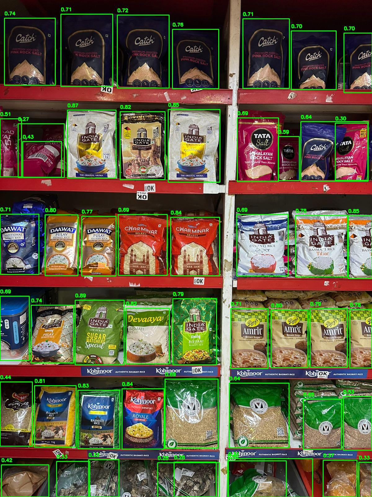
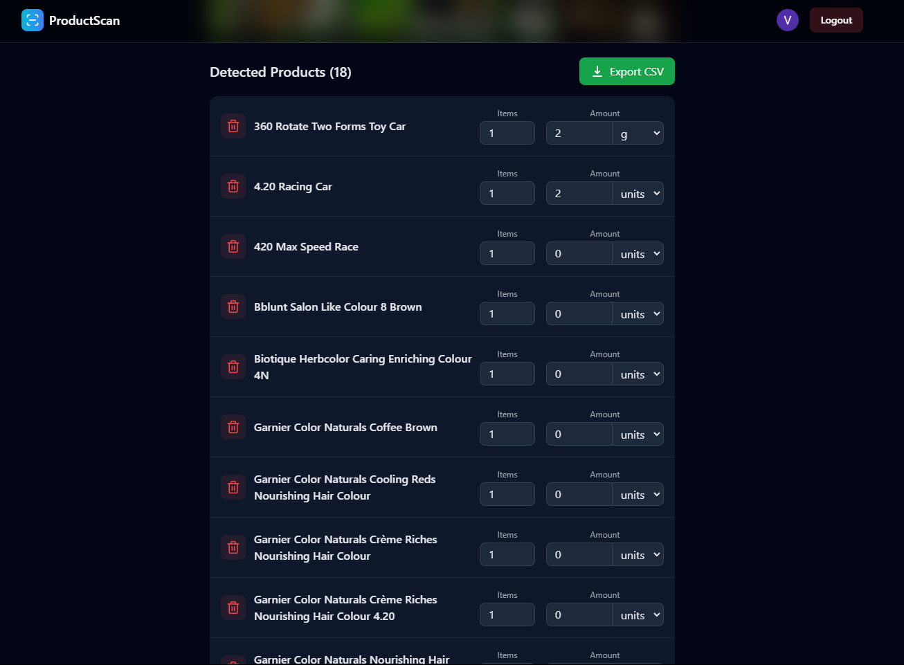

# Problem Statement
Retail stores(12 to 13 Million) in India struggle to leverage business posibilities through ecommerce due to technical challenges.

# Proposed Solution
A web-app which requires user to click image of store shelves and it segments items, identifies them and adds description and category to it which ensures proper SEO performance. At intersection of Computer vision and LLM application, this provides a scalable solution with inference of over 41 items in 8 seconds.

# Process

- We started with using yolov5 with large parameters but then switched to `yolov11nano` for faster inference time
- We used `yolov11nano` model to segment products from the shelf image into images of each product
- Results from `yolov11nano`:
  
  
  
- After getting the bounding boxes on the products, we cropped them and fed the images to `GEMINI API` with propmts for it to identify the product in the image
- Made calls to the model and the api using flask and the results are as follows: 


# Setting up Locally
- Clone the repository
```bash
git clone https://github.com/
cd cloned-repo/frontend
npm install
cd ..
cd backend
pip install -r requirements.txt
```
To run the `frontend` run this command in the frontend directory
```bash
npm run dev
```
To run the `backend` run this command in the backend directory
```bash
python app.py
```

# Tech Used
- For frontend reactjs with tailwind was used
- The backend runs using flask to make requests to the model and the Gemini API
- The model utilizes YOLO v11n for nearly instant and fairly accurate object detection and cropping in the shelf image.
- Gemini 1.5 flash with 8 billion parameters was used for quick item recognition with added benefits of formatting, filtering unique items, fuzzy identification and context awareness at a low cost both computationally and in terms of API cost.
  
  
